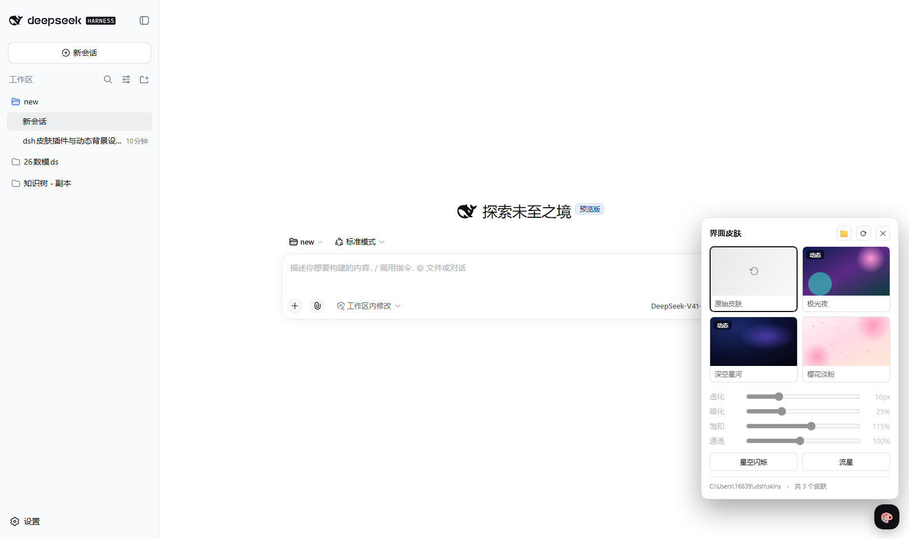
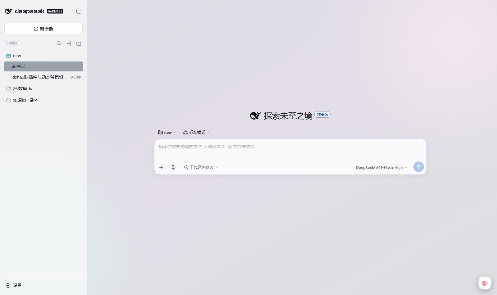
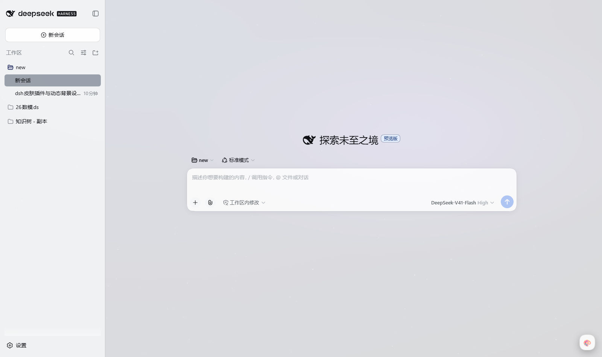
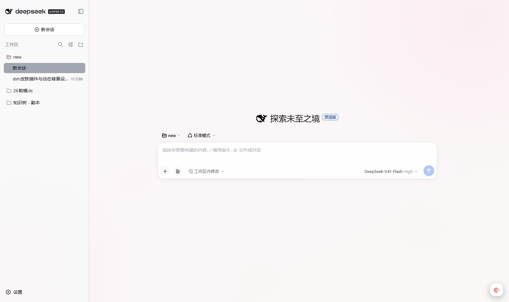
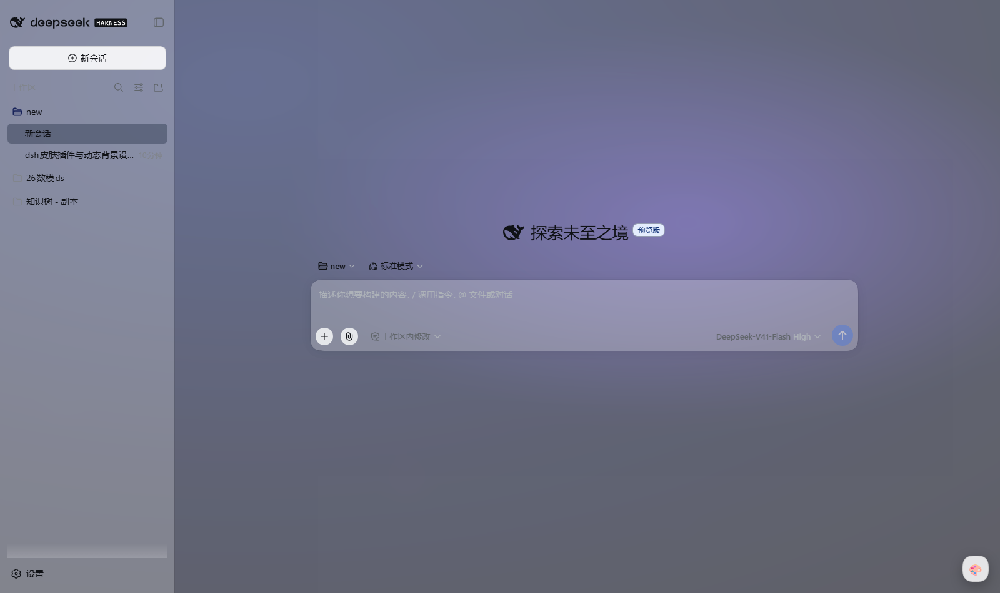
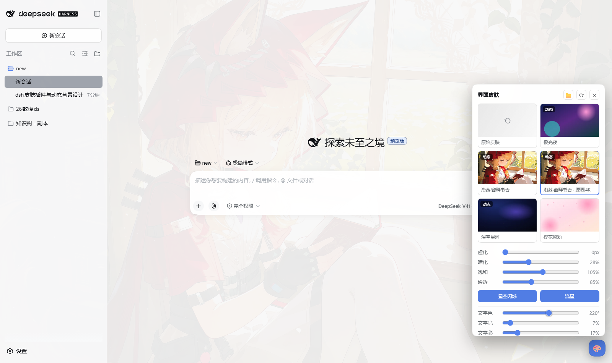
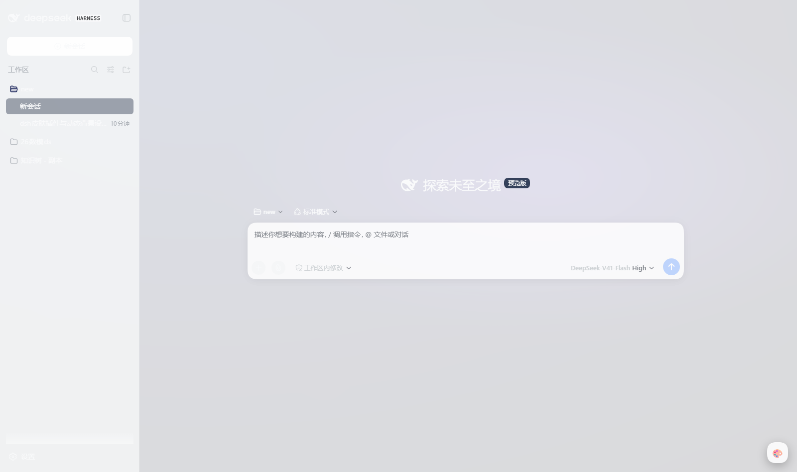
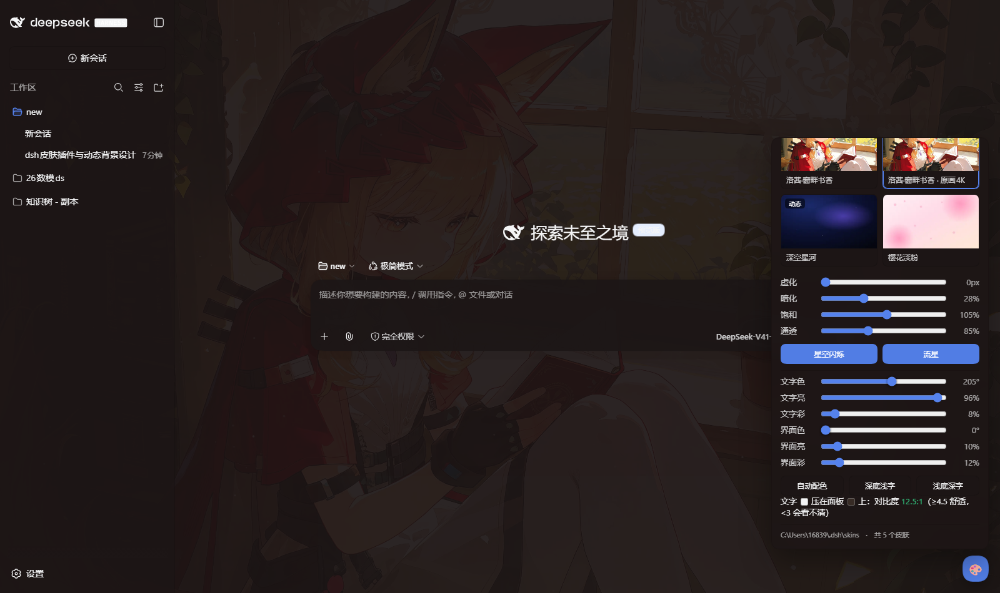

# dsh 界面皮肤插件（dsh-skin）

给 DeepSeek Harness 的 Web 界面换皮肤：**本地文件夹放素材 → 界面上直接切换**，支持静态图片、GIF、视频，
支持从图片自动提取主题色改写整套 UI 配色，还带**星空闪烁 / 流星划过**的 Canvas 动态效果。
原始皮肤（默认主题）永远保留，随时一键还原。

## 截图

| 面板 | 极光夜（动态星空） | 深空星河 |
|---|---|---|
|  |  |  |

| 樱花淡粉 | 通透拉满（看背景） | 配色微调 |
|---|---|---|
|  |  |  |

| 深色主题 | 深底浅字 |
|---|---|
|  |  |

---

## 1. 安装

双击本目录下的 **`安装皮肤插件.cmd`**（或在该目录执行
`powershell -ExecutionPolicy Bypass -File .\install.ps1`）。它会：

1. 把插件复制到 `%USERPROFILE%\.dsh\profiles\web\node_modules\dsh-skin`；
2. 把 `dsh-skin` 追加进 `~/.dsh/profiles/web/package.json` 的 `dsh.profile.bundles`；
3. 创建皮肤文件夹 `%USERPROFILE%\.dsh\skins`。

然后**重启 dsh**（关掉正在运行的 `dsh web`，重新运行），刷新页面，右下角出现 🎨 按钮即安装成功。

> 卸载：`powershell -ExecutionPolicy Bypass -File .\install.ps1 -Uninstall`
> （只移除插件本体，`~/.dsh/skins` 里的素材会保留）

---

## 2. 使用

### 界面操作

点右下角 **🎨**：

| 控件 | 作用 |
|---|---|
| 皮肤卡片 | 点一下立即切换；第一张「原始皮肤」= 恢复 dsh 默认外观 |
| 虚化 | 背景图模糊程度（0–60px） |
| 暗化 | 背景图上叠一层黑（0–85%），图片太亮/太花时压一压 |
| 饱和 | 背景图饱和度（0–200%） |
| 通透 | 面板/侧栏等"结构面"的透明度。往右拖 = 图更明显，往左拖 = 界面更实、更好读 |
| 星空闪烁 / 流星 | 在背景上加动态粒子效果 |
| **文字色 / 文字亮 / 文字彩** | 自定义正文文字颜色（色相 / 明度 / 饱和度）。拖「文字色」会自动给一点饱和度和中间明度，让你能看清挑的是什么颜色 |
| **界面色 / 界面亮 / 界面彩** | 自定义面板、侧栏这些"结构面"的底色（半透明压在背景上），决定文字是压在亮底还是暗底上 |
| 自动配色 / 深底浅字 / 浅底深字 | 一键预设：恢复主题色 / 深色面板+浅色文字 / 浅色面板+深色文字 |
| 对比度 x.x:1 | 实时读数：把你的文字色压在"面板色+背景平均色"上算出的 WCAG 对比度。**≥4.5 舒适，3~4.5 勉强，<3 会看不清**（红色警告） |
| 📁 | 在资源管理器里打开皮肤文件夹 |
| ⟳ | 重新扫描皮肤文件夹（新丢进去的图片立刻出现） |


> 背景太花、字看不清时的标准做法：先拖「文字色」/「文字亮」把文字调到能看清，
> 再看对比度读数（绿色 ≥4.5 即可）；如果背景本身太亮/太暗，再拖「界面色」/「界面亮」把面板压成深色或浅色。
> 每个皮肤的这些配色都会各自记住。

每个皮肤的虚化/暗化/饱和/通透/动态开关都会**分别记住**；当前选了哪个皮肤也会记住，
存在 `~/.dsh/skins/state.json`，换端口、重开浏览器都不会丢。

### 让模型帮你做

插件还注册了 5 个工具，直接在对话里说就行：

| 工具 | 说明 |
|---|---|
| `skin_create` | **一键生成皮肤**：给一张图片/视频的路径，它复制进皮肤文件夹、自动提取主题色与主色板、写好清单；`type: dynamic` 时顺便开启动态效果 |
| `skin_list` | 列出所有皮肤和当前启用的皮肤 |
| `skin_use` | 切换皮肤（`default` 恢复原始皮肤） |
| `skin_delete` | 删除皮肤 |
| `skin_open_folder` | 打开皮肤文件夹 |

例如：

> 把 `D:\pics\night.png` 做成动态皮肤，虚化 24，叫「午夜」

模型会调用 `skin_create`，之后你在 🎨 面板里就能看到它。

---

## 3. 皮肤文件夹

`%USERPROFILE%\.dsh\skins`，两种放法都行：

**放法 A —— 直接把图片/视频丢进去（最简单）**

```
skins/
  我的壁纸.png          → 皮肤 id = "我的壁纸"
  夜空.mp4              → 视频背景（循环静音自动播放）
```

**放法 B —— 一个文件夹 + 清单（可写更多参数）**

```
skins/aurora-night/
    skin.json
    background.png      （或 .jpg/.webp/.gif/.mp4/.webm/.mov/.avif/.svg）
```

`skin.json` 字段（全部可选）：

```jsonc
{
  "name": "极光夜",              // 面板里显示的名字
  "type": "dynamic",            // static | dynamic（dynamic 默认开星空+流星）
  "file": "background.png",     // 不写就自动找文件夹里第一个媒体文件
  "blur": 20,                   // 默认虚化
  "dim": 0.32,                  // 默认暗化 0~1
  "saturate": 1.1,              // 默认饱和
  "accent": "#7c5cff",          // 主题色；不写就由浏览器从图片里提取并回写到这里
  "palette": ["#0c1b4d", "..."],// 主色板
  "effects": { "stars": true, "meteors": true, "density": 1 }
}
```

支持的格式：`.png .jpg .jpeg .webp .gif .avif .bmp .svg`（图片）、`.mp4 .webm .mov .m4v .ogv`（视频）。

---

## 4. 主题色是怎么作用于界面的

dsh 的 Web UI 全部颜色都走 `--dsw-*` 设计令牌。本插件在皮肤启用时：

1. 先读出当前主题（浅色/深色）下各 **原生令牌值**，缓存到 `--dsh-skin-base-*`；
2. 用 `ctx.theme.overrideTokens()`（官方扩展点）叠一层覆盖：
   - 结构面（页面底色、面板层 1/2/3、侧栏、输入框、气泡…）→ 半透明的 `rgba()`，让背景图透出来，透明度由「通透」控制；
   - 强调色（brand-primary、link、主按钮）→ 由提取出的主题色推导，并做**亮度兜底**（浅色主题压暗、深色主题提亮），保证按钮/链接始终能看清；
3. 切浅色/深色时自动重抓一遍原生值再重算，所以深浅色下都不会出现看不清的配色；
4. 选「原始皮肤」时这一层覆盖会被完整撤掉，不留痕迹。

背景图本身放在一个 `position: fixed; z-index: -1` 的图层里（图片 + 视频 + 星空画布 + 暗化层），
所有覆盖都在 `body` 的内联令牌上，不会动 dsh 自己的样式表。

---

## 5. 卸载 / 排错

| 现象 | 处理 |
|---|---|
| 装完没反应 | 必须**重启 dsh 进程**（浏览器刷新不够）；改完插件代码同理 |
| 面板里没有新图片 | 点 ⟳；确认文件扩展名在支持列表里、没放在子文件夹的子文件夹里 |
| 界面太花看不清字 | 把「通透」往左拖（面板更实），或把「暗化」调大 |
| 图片太暗、界面发闷 | 「通透」往右拖，或把「暗化」调小 |
| 以后执行过 `dsh plugin --profile web ...`（pnpm 可能清掉 node_modules 里的插件） | 重新双击 `安装皮肤插件.cmd` 即可 |
| 想完全卸载 | `install.ps1 -Uninstall`，再删 `~/.dsh/skins` |

---

## 6. 目录结构

```
dsh-skin-plugin/
├─ 安装皮肤插件.cmd        # 双击安装
├─ install.ps1            # 安装/卸载脚本
├─ package.json           # dsh 插件清单：main=宿主半边，exports["./client"]=浏览器半边，dsh.client 声明
├─ cordis.patch.yml       # bundle 补丁：把宿主半边的行插进插件树
└─ lib/
   ├─ index.js            # 宿主半边（Node）：皮肤文件夹、HTTP 接口、模型工具、图片分析(sharp)
   └─ client.js           # 浏览器半边：背景层、令牌覆盖、星空/流星、🎨 面板
```

接口一览（宿主半边注册在 web 服务上）：

| 路径 | 说明 |
|---|---|
| `GET /skin-api/list` | 皮肤清单 + 当前状态 |
| `GET/POST /skin-api/state` | 读/写当前皮肤与每个皮肤的覆盖参数 |
| `POST /skin-api/palette` | 浏览器回写提取出的主题色 |
| `GET /skin-api/thumb/<id>` | 面板缩略图（sharp 生成 webp） |
| `POST /skin-api/open` | 打开皮肤文件夹 |
| `GET /skin-files/<id>/<file>` | 皮肤素材本体（支持 Range，视频可拖动） |

> 这些路径只提供本机界面使用；dsh 的 web 服务默认只监听 127.0.0.1。